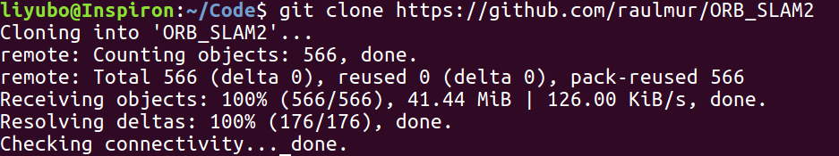
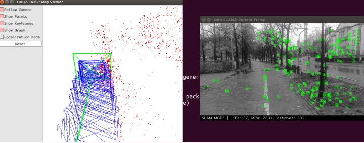

###2熟悉Linux
1. 在Ubuntu 中安装软件使用sudo apt-get install命令,通常软件安装在都安装在/usr或/usr/share或/usr/local文件目录下
2. 环境变量是Linux系统预定义的参数,添加当前shell的环境变量使用export命令。
   定义当前用户的环境变量在.bash_profile进行定义，定义所有用户的环境变量在etc/profile进行定义。
   ROS系统中setup脚本实现环境变量的设置，在，bashrc中添加执行脚本命令
    >PATH 定义 shell将到哪些目录中寻找命令或程序  
    HOME 定义 当前用户主目录  
3. 根目录的结构为，

     |文件夹|作用| 
     |:---:|:---:| 
     |include|存放源文件|
     |src|生成动态库的源文件|
     |Examples|生成可执行程序 |
    
4. 执行chmod  +x  a.sh 命令
5. 输入命令 sudo chown xiang  a.sh && sudo chgrp xiang  a.sh

###3LAM综述文献阅读
1. 应用领域：增强现实，三维重建，定位与地图构建
2. SLAM 中定位与建图是相互依存的，为了在环境中精确地定位，需要正确的地图，但是为了构建好的地图，当元素被添加到地图时，必须正确定位。
3. 经典时期（1986-2004）：研究重点在滤波器 算法研究时期（2004 - 2015年）算法分析期间研究了SLAM的基本性质
4. 列举三篇在 SLAM 领域的经典文献。
* 提出ORBSLAM:Mur-Artal R, Montiel J M M, Tardos J D. ORB-SLAM: a ver-satile and accurate monocular SLAM system[J]. IEEE Transac-tions on Robotics, 2015, 31(5): 1147-1163
* 提出LSD_SLAM,基于直接法 :Engel J, Schöps T, Cremers D. LSD-SLAM: large-scale direct monocular SLAM[C] //Proceedings of Computer Vision – ECCV 2014. Heidelberg: Springer, 2014: 834-849
* TSDF算法：Curless B, Levoy M. A volumetric method for building com-plex models from range images[C] //Proceedings of the 23rd Annual Conference on Computer Graphics and Inter-ActiveTechniques. New York: ACM Press, 1996: 303-312
###4Cmake练习

``` cmake
    cmake_minimum_required(VERSION 2.8)
    
    project( HelloSLAM )
    
    set( CMAKE_BUILD_TYPE "Release" )
    
    include_directories( "include" )
     #.a 静态库 STATIC .so 动态库 SHARED
    add_library( libhello SHARED src/hello.cpp )
    
    add_executable( sayhello useHello.cpp )
    
    target_link_libraries( sayhello libhello )
    
    INSTALL
    (
        #LIBRARY 动态库 #ARCHIVE 静态库
        TARGETS  libhello 
        LIBRARY DESTINATION /usr/local/lib 
    )
    INSTALL
    (
        DIRECTORY include/ DESTINATION /usr/local/include
    )
```
###5理解ORB-SLAM2

1. 下载ORB-SLAM2 截图为

    
2. 分析ORB-SLAM2

* 生成一个动态函数库，路径为lib/libORB_SLAM2.so  
    生成7个可执行文件,fenbieweirgbd_tum，stereo_kitti，stereo_kitti，stereo_euroc，mono_tum，mono_kitti，mono_euroc
* 文件夹内容为
    
    |    |    |
    |:---|:---|
    |include|存放源文件|
    |src|生成动态库的源文件|
    |Examples|生成可执行程序 |
    
* 链接的库为：OpenCV,EIGEN3,Pangoli,DBoW2,g2o


###6使用摄像头或视频运行 ORB-SLAM2
1. 编译完成图为 
   
2. 修改CmakeList.txt 添加如下代码
``` cmake
  set(CMAKE_RUNTIME_OUTPUT_DIRECTORY ${PROJECT_SOURCE_DIR}/code)
  add_executable(myvideo
          code/myvideo.cpp)
  target_link_libraries(myvideo ${PROJECT_NAME})
  
  add_executable(myslam
          code/myslam.cpp)
  target_link_libraries(myslam ${PROJECT_NAME})
  
```
3. 运行ORB-SLAM2,截图如下
   
    

